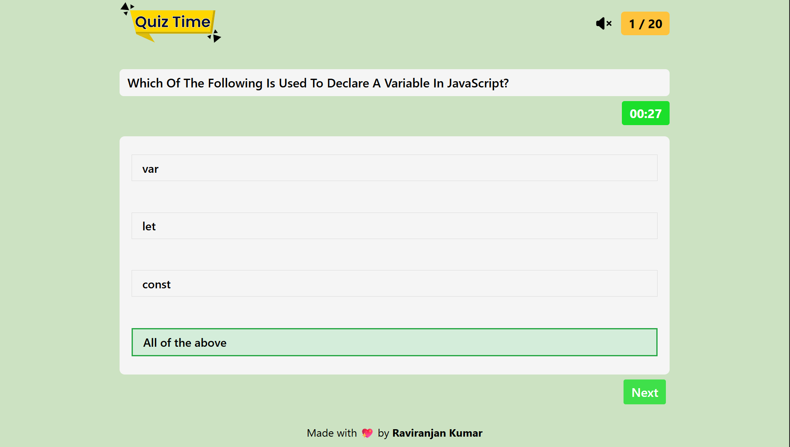
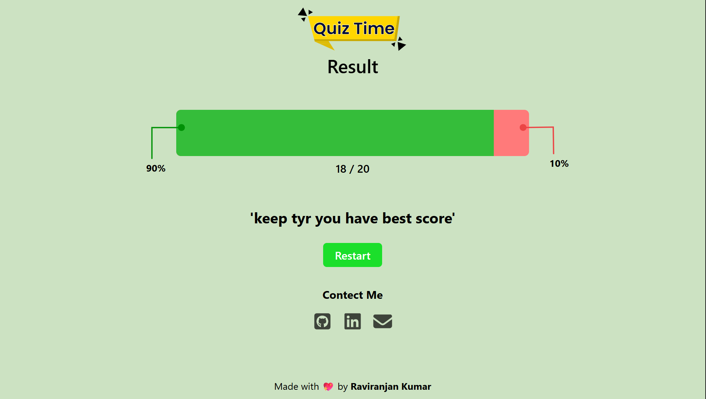

# 🧠 JavaScript Quiz App

An interactive **JavaScript Quiz Application** built using **HTML, CSS, and Vanilla JavaScript**, designed to test and enhance your JavaScript knowledge in a fun and engaging way.  
The app includes a timer, sound effects, dynamic score calculation, and beautiful UI transitions.

---

## 🖼️ Screenshots

### 🏠 Desktop-views
.png)
---

---

## 🚀 Features

✅ **Start Quiz Page** – Clean and attractive start screen with a start button.  
✅ **Dynamic Question System** – Questions and options are rendered from a JavaScript object array.  
✅ **Single Answer Selection** – Prevents multiple option selections per question.  
✅ **Real-Time Timer** – Countdown starts at 30 seconds with color alerts for time thresholds.  
✅ **Sound Effects** –  
- 🔊 Right answer sound  
- ❌ Wrong answer sound  
- ⏰ Warning sound when time is low  
- 🎵 Background sound (toggle on/off)  
✅ **Automatic Score Calculation** – Displays total, correct %, and wrong %.  
✅ **Responsive Design** – Fully optimized for mobile, tablet, and desktop.  
✅ **Restart Option** – Retake the quiz anytime.  
✅ **Social Links Section** – Connect via GitHub, LinkedIn, or Gmail.

---

### 📚 Quiz Interface
Displays questions, timer, and multiple-choice options.

### 🏁 Result Page
Shows total score, correct/incorrect percentage, and progress bar.

---

## 🧩 Tech Stack

| Technology | Purpose |
|-------------|----------|
| **HTML5** | Structure of the quiz |
| **CSS3** | Styling and responsive design |
| **JavaScript (ES6)** | Dynamic quiz logic and interactivity |
| **Audio API** | For sound effects |

---

## ⚙️ How It Works

1. Click **"Start Now"** to begin the quiz.
2. A question and four options will appear.
3. Select one option — it locks once clicked.
4. Timer counts down from **30 seconds**:
   - 🟡 At 15 seconds → soft warning color  
   - 🔴 At 7 seconds → alert color and sound
5. Get instant feedback for right/wrong answers.
6. Click **Next** to move to the next question.
7. After all questions → your result page appears.

---

## 🧮 Scoring Logic

- ✅ **Correct Answer:** +1 point  
- ❌ **Wrong Answer:** 0 point  
- Final score = `Number of Correct Answers / Total Questions`

---

## 🧠 Topics Covered in Quiz

- JavaScript variables and constants  
- Data types and operators  
- Functions and arrow functions  
- JSON methods  
- Arrays and built-in methods  
- Equality operators  
- Type checking  
- Control statements

---

## 🧑‍💻 Developer

**👨‍💻 [Raviranjan Kumar](https://www.linkedin.com/in/raviranjanmishra01)**  
Frontend Web Developer | MERN Stack Learner  

🔗 **GitHub:** [RaviranjanMishra01](https://github.com/RaviranjanMishra01)  
📧 **Email:** [raviranjanmishra767@gmail.com](mailto:raviranjanmishra767@gmail.com)

---

## 🏁 Future Enhancements

- Add **category-wise questions** (HTML, CSS, React, etc.)  
- Include **leaderboard system** using localStorage or Firebase  
- Allow **custom quiz creation**  
- Add **dark/light mode toggle**

---

## 💖 Acknowledgment

Made with ❤️ by **Raviranjan Kumar**

---

